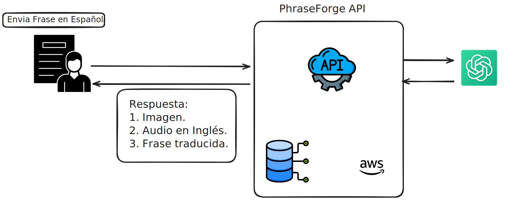
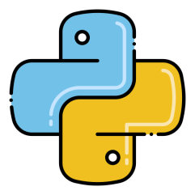
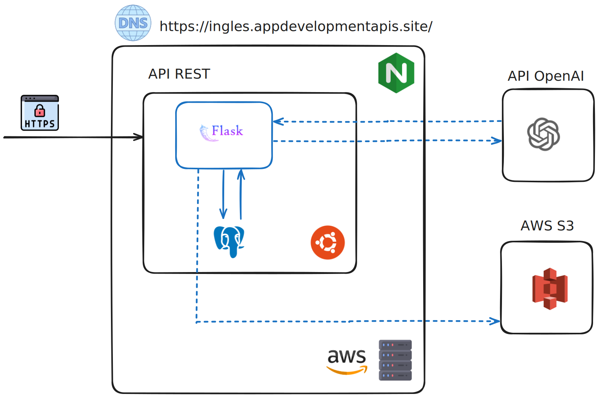
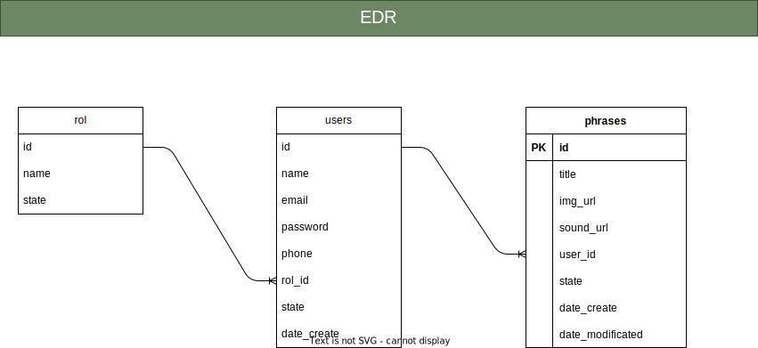

# PhraseForge API 
Este proyecto surge de la necesidad de mejorar el vocabulario y la pronunciación del idioma inglés, ya que siempre se recomienda enfocarse en aprender frases completas. De esta idea nació la creación de una API que permite generar estas frases en inglés de manera automatizada.

**URL de la API desplegada**: `https://ingles.appdevelopmentapis.site/`

## ¿Cómo funciona?



Como se aprecia en la imagen, la API se encarga de generar frases en inglés de manera automática apartir de una frase en español. Estas frases se almacenan en una base de datos y se podra acceder en cualquier momento.

## Tabla de Contenidos
1. [Tecnologías](#tecnologías)
2. [Funcionamiento](#funcionamiento)
3. [Documentación](#documentación)
5. [Despliegue](#despliegue)
6. [Deuda Técnica](#deuda-técnica)


# Tecnologías
La API se desarrolló utilizando las siguientes tecnologías:

## Python 


La API se desarrolló en Python, utilizando el micro-framework Flask. Utilizando el ORM SQLAlchemy, se crearon las tablas y modelos necesarios para la aplicación. Además, se utilizó Flask-RESTX para crear los endpoints RESTful y Flask-JWT-EXT para gestionar los tokens de autenticación.

## OpenAI


Se utilizó la API de OpenAI para poder realizar las siguientes tareas:
- Obtener la frase traducida de Español a Inglés.
- Generar con DALL-E un imagen basado en una frase.
- Generar el audio de la frase traducida.

## AWS
<table border="0">
  <tr>
    <td></td>
    <td></td>
    <td></td>
  </tr>
</table>

Para el tema de despliegue, se utilizó el servicio de AWS EC2 utilizando el servidor con el sistema operativo Ubuntu 22.04. Para la creación del servidor web se utilizo Nginx, que se encarga de servir las peticiones HTTP y redireccionarlas a Flask.

## PostgreSQL


La base de datos que se utiliza es PostgreSQL. Esto a su vez se encuentra desplegado en un servicio de AWS EC2 con el sistema operativo Ubuntu 22.04.


# Funcionamiento

## Infraestructura
La infraestructura de la aplicación se ha diseñado utilizando **AWS**. A continuación, se presenta la imagen de la arquitectura.




## Modelado de la base de datos


- Según el diagrama EDR, se puede ver que la base de datos se divide en tres tablas principales: users, roles y phrases.
- La tabla users contiene información sobre los usuarios registrados en la aplicación, incluyendo su nombre, correo electrónico, contraseña y su rol.
- La tabla phrases tiene información sobre las frases generadas por los usuarios, incluyendo su título, URL de la imagen, URL de la audio y el usuario que las creó.

## API Restful

La lógica de negocio para la API Restful se divide en tres secciones: usuarios y generación de frases.

### Usuarios
Para que los usuarios puedan acceder a la aplicación, deben crear una cuenta. Por defecto, los usuarios tienen un rol básico. Luego, deben validar su correo electrónico mediante un código de verificación para poder acceder a las funciones de la aplicación. Después, deben iniciar sesión, obtener el token JWT y podrán realizar consultas a la API, como la creación de frases.

### Frases
Una vez que los usuarios han iniciado sesión, tienen la capacidad de generar frases en inglés. Para hacerlo, deben enviar su frase en español, y la API se encargará de generar tanto una imagen como un archivo de audio en inglés. El proceso se divide en los siguientes pasos:

**Traducción de la Frase:** La frase en español es traducida automáticamente mediante la API de OpenAI, que proporciona un endpoint especializado para esta tarea. Una vez obtenida la traducción, esta se almacena en la tabla phrases para su uso posterior.

**Generación de la Imagen:** Para crear una imagen basada en la frase traducida, utilizamos la API de DALL-E. La imagen generada se almacena en el servicio de AWS S3 y la URL correspondiente se guarda en la tabla phrases, permitiendo su fácil recuperación desde AWS.

**Generación del Audio:** El mismo proceso se repite para la creación del archivo de audio en inglés. La traducción de la frase se envía a la API de OpenAI, la cual genera el audio. Este archivo se almacena también en AWS S3 y la URL del archivo de sonido se guarda en la tabla phrases, asegurando su acceso en el servicio de AWS.

# Documentación

Toda la documentación relacionada con la API se ha realizado utilizando **Swagger**. Para acceder a la documentación interactiva y explorar los endpoints disponibles, puedes visitar la siguiente URL:

**[Accede a la Documentación de la API aquí](https://ingles.appdevelopmentapis.site/)**

Las secciones de la documentación son las siguientes:

**1. Services**: Contiene las frases que se han generado de manera de prueba para visualizar el funcionamiento de la API.

**2. Autenticación**: Contiene la información sobre la autenticación de usuarios, incluyendo el proceso de registro, inicio de sesión y validación de código de verificación.

**3. Phrases**: Contiene la información sobre la generación de frases en inglés, listar todas las frases generadas, obtener la imagen de la frases y obtener el audio de la frases.


# Despliegue
Para poder desplegar la aplicación en su local o servidor propio es necesario seguir los siguientes pasos:

### **:one:**  Clonar el repositorio.

### **:two:** Instalar las dependencias necesarias del archivo `requirements.txt`.

### **:three:** Crear un archivo `.env`

En la raíz del proyecto con las siguientes variables de entorno:

```python
        SQLALCHEMY_DATABASE_URI = <url de la base de datos>
        DATABASE_USER = <usuario de la base de datos>
        DATABASE_PASSWORD = <contraseña de la base de datos>
        DATABASE_PORT = <puerto de la base de datos>
        AWS_ACCESS_KEY_ID = <clave de acceso a AWS>
        AWS_SECRET_ACCESS_KEY = <clave de acceso secreto a AWS>
        REGION_NAME = <nombre de la región de AWS>
        BUCCKET_NAME = <nombre del bucket de AWS>
        OPENAI_KEY = <clave de API de OpenAI>

        EMAIL_USER = <usuario de correo electrónico>
        EMAIL_PASSWORD = <contraseña de correo electrónico para app de tercero>

        JWT_SECRET_KEY = <clave secreta para JWT>
        JWT_ACCESS_TOKEN_EXPIRES = <tiempo de expiración de token de acceso>
        JWT_REFRESH_TOKEN_EXPIRES = <tiempo de expiración de token de refresco>
        FLASK_APP = 'main.py'
        FLASK_DEBUG = <booleano para desarrollo local>
```

### **:four:** Posteriormente, ejecutar las migraciones de la base de datos con el siguiente comando:

```
    flask db migrate
```
### **:five:** Crear una carpeta en la raiz del proyecto 

El nombre de la carpeta debe ser `seeds` y dentro de ella, crear un archivo llamado `roles_seeder.py` y `users_seeder.py`, con el siguiente contenido:

```python
        ## Archivo roles_seeder.py
        from flask_seeder import Seeder
        from app.models.roles_model import RoleModel


        class RoleSeeder(Seeder):
            def run(self):
                pass
                roles = [
                    {
                        'name': 'Administrador',
                    },
                    {
                        'name': 'Usuario Base'
                    }
                ]
                for role in roles:
                    record = RoleModel.where(name=role['name']).first()
                    if not record:
                        new_record = RoleModel.create(**role)
                        self.db.session.add(new_record)
```

```python
        ## Archivo users_seeder.py
        from flask_seeder import Seeder
        from app.models.users_model import UserModel


        class UserAdminSeeder(Seeder):
            def run(self):
                users = [
                    {
                        'name': <nombre del usuario>,
                        'password': <contraseña del usuario>,
                        'email': <correo electrónico del usuario>,
                        'rol_id': 1
                    }
                ]
                for user in users:
                    record = UserModel.where(email=user['email']).first()
                    if not record:
                        print(f'Se crea usuario -> {user}')
                        new_record = UserModel.create(**user)
                        new_record.hashPassword()
                        self.db.session.add(new_record)
```

### **:six:** Cargar los roles y sus usuarios:
```
    flask db seed
```
### **:seven:** Iniciar el servidor de Flask:
```
    flask run
```

# Deuda Técnica

### **:one:**  Devolución de los recursos de imagenes y sonidos generados.
Buscar una mejor forma de devolver los recursos debido a que la API actualmente esta devolviendo el archivo en base64 y no en formato original. Una posible solución seria brindar una dirección URL para acceder a los recursos, pero esto requeriría una implementación adicional en el servidor de AWS.

### **:two:**  Obtener también la traducción de la descripción de la frase.
Actualmente, la API solamente devuelve la imagen y el sonido de la frase, pero no de la descripción. Esto se solucionaría agregando una nueva columna en la tabla `phrases` para guardar la traducción de la descripción de la frase.

### **:three:**  Mejorar el manejo de errores.
Para mejorar el manejo de errores, se podría implementar una función de manejo de errores personalizada en la API. Esto permitiría a la API devolver mensajes de error más detallados y específicos, como por ejemplo "No se pudo generar la imagen debido a un error de conexión a la base de datos".